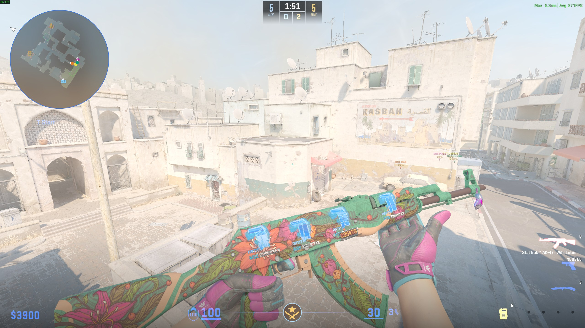
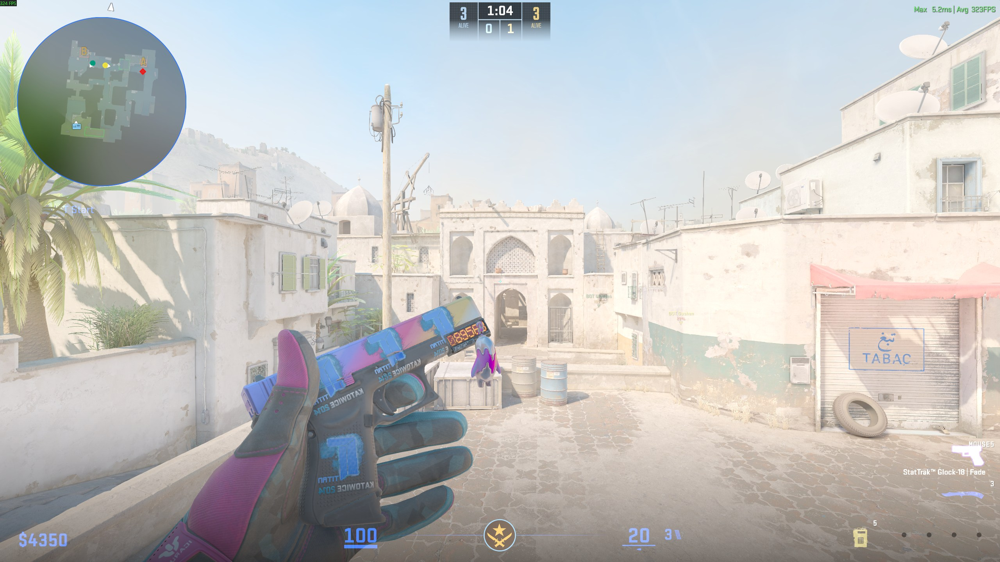

# SeedCommand

A CounterStrikeSharp companion plugin for [Nereziel/cs2-WeaponPaints](https://github.com/Nereziel/cs2-WeaponPaints) that adds **instant in-game skin / knife / glove / sticker pickers** with **automatic application of community-known tier-1 seed patterns** and Factory New wear.

> Code 100% generated by [Claude Code](https://claude.ai/code).
> Commissioned by **Mavi** — [Steam profile](https://steamcommunity.com/profiles/76561198147748231/).
> Attribution to that Steam profile is required when redistributing this plugin.
> No monetary compensation requested — only acknowledgment.


*Butterfly Knife Doppler menu — paint IDs in brackets `[415]` `[421]` `[619]` let you pick the exact phase (Ruby / Phase 4 / Sapphire / Black Pearl / Phase 2) which is otherwise indistinguishable since WeaponPaints' data calls every variant just "Doppler".*

<details>
<summary>More screenshots</summary>

**`!k` — knife type picker (the first menu after typing `!k`):**


**`!ws` — full skin menu for the held weapon (AK-47 here):**


**Result — Titan (Holo) Katowice 2014 stickers applied to StatTrak™ AK-47 | Wild Lotus:**


**StatTrak™ Glock-18 | Fade with Titan (Holo) Katowice 2014:**


</details>

---

## What it adds

### Commands

| Command | Effect |
|---|---|
| `!k` / `!knife` | Knife type menu → on pick, instantly chains to skin menu for that knife → pick → applied with best seed + FN wear + **instant visual refresh** |
| `!ws` | Skin menu for the weapon you're currently holding → pick → applied with best seed + FN wear + instant refresh |
| `!gloves` | Flat list of every glove skin → pick → applied (visual on next round) |
| `!sticker` / `!stickers` | Curated menu of 13 high-value tournament stickers → pick → pick slot 1-5 (or **"ALL 5 slots"** to apply to every slot at once) → applied + refresh |
| `!seed <n>` | Manually set the paint seed on the held weapon |
| `!bestseed` | Apply the best community-known seed for the held weapon's current paint |
| `!wear <0-1>` / `!float <0-1>` | Set the wear/float of the held weapon (e.g. `!wear 0.001`, `!wear 0.5`). Wear tier auto-reports back: FN / MW / FT / WW / BS |
| `!fn` | Shorthand for `!wear 0.000001` (Factory New minimum) |

All commands work in chat with the `!` prefix or in console with the `css_` prefix (e.g. `css_seed 661`).

### Behind the scenes (no command needed)

- **Auto best-seed on every paint change** — when a row's `weapon_paint_id` changes in `wp_player_skins` (from any source — your menu, WeaponPaints' own `!ws`, manual SQL), a MariaDB trigger looks up the (defindex, paint_id) pair in a bundled `best_seeds` table and sets the seed automatically. **No matter how you change a skin, the legendary pattern applies.**
- **Auto Factory New wear** — same trigger resets `weapon_wear` to `0.000001` on every paint change.
- **Doppler phase labels** — every Doppler/Gamma Doppler entry in the skin menu is decorated with its phase: `Doppler (Ruby)`, `Doppler (Sapphire)`, `Doppler (Black Pearl)`, `Doppler (Phase 1-4)`, `Gamma Doppler (Emerald)`, etc. — instead of WeaponPaints' raw "Doppler" for all 7 variants.
- **Butterfly Knife paint ID handling** — Butterfly uses non-standard paint IDs (`617` Black Pearl, `618` Phase 2, `619` Sapphire instead of standard 416/417/419). The menu labels these explicitly with `[paint_id]` brackets so they're never ambiguous.
- **Talon Knife paint ID handling** — Talon's Phase 1-4 use paints 852-855 (not the standard 418-421). Labeled accordingly.
- **Instant visual refresh** — the plugin calls WeaponPaints' `WeaponSync.GetPlayerData()` + `RefreshWeapons()` via reflection right after applying, so the skin appears immediately (no `!wp` typing, no round restart, no respawn needed).

## How it works

Three mechanisms working together:

1. **Menu interception** — The plugin intercepts `!k`, `!ws`, `!gloves`, `!sticker` chat commands BEFORE WeaponPaints sees them and opens its own menus using the same MenuManager interface (`menu:nfcore` capability) WP uses for `!gloves`. This is what gives the "instant chain" feel — there's no waiting for WP's menu to close.

2. **MariaDB triggers** (installed by `setup.sql`) fire on every `wp_player_skins` row change. When the `weapon_paint_id` column changes, the trigger:
   - Looks up the `(defindex, paint_id)` pair in a `best_seeds` table that ships with 299+ community-verified tier-1 patterns
   - If a best seed is known, sets `weapon_seed` to it
   - Resets `weapon_wear` to `0.000001` (Factory New)

3. **Reflection-based WP refresh (v4.3+)** — Instead of trying to inject `!wp` via the chat-trigger path (which doesn't reliably fire when sent by another plugin), this plugin loads the WeaponPaints assembly via reflection and calls its `WeaponSync.GetPlayerData()` + `RefreshWeapons()` methods directly on the WP instance. **This is what makes skin changes instant — no need to type `!wp` manually, no respawn needed.**

## Requirements

- [Metamod:Source](https://www.sourcemm.net/)
- [CounterStrikeSharp](https://github.com/roflmuffin/CounterStrikeSharp) (the plugin was built against 1.0.305, runtime tested up to 1.0.367)
- [WeaponPaints](https://github.com/Nereziel/cs2-WeaponPaints) (this plugin reads its DB and JSON data; the DB triggers operate on `wp_player_skins`)
- [MenuManager](https://github.com/schwarper/cs2-MenuManager) (registered as capability `menu:nfcore` — same one WP uses)
- A MariaDB / MySQL server (already used by WeaponPaints)
- `sv_cheats 1` if you want the "instant visual refresh" feature (the `give` command requires it)

## Install

1. Copy `SeedCommand.dll` and its dependencies into `addons/counterstrikesharp/plugins/SeedCommand/`
2. Run `setup.sql` against the same database WeaponPaints uses:
   ```sh
   mariadb -u <user> -p <database> < setup.sql
   ```
   This creates the `best_seeds` table, populates it with 299+ tier-1 patterns, and installs the triggers. **The script is idempotent** (uses `CREATE TABLE IF NOT EXISTS` and `INSERT ... ON DUPLICATE KEY UPDATE`) — safe to re-run after pulling updates.
3. Edit `addons/counterstrikesharp/configs/plugins/SeedCommand/SeedCommand.json` with your DB connection details (defaults to `127.0.0.1:3306` with the standard WeaponPaints credentials).
4. Restart the server or `css_plugins reload SeedCommand`.

## Configuration

`SeedCommand.json` is auto-generated on first load:

```json
{
  "DatabaseHost": "127.0.0.1",
  "DatabasePort": 3306,
  "DatabaseUser": "weaponpaints",
  "DatabasePassword": "cs2_local_pw",
  "DatabaseName": "weaponpaints",
  "SkinsJsonPath": "",
  "GlovesJsonPath": "",
  "ForceWeaponRefresh": true,
  "ForceRespawnOnSkinChange": false
}
```

| Setting | Default | Effect |
|---|---|---|
| `DatabaseHost` / `Port` / `User` / `Password` / `Name` | localhost WP defaults | Same DB you use for WeaponPaints |
| `SkinsJsonPath` / `GlovesJsonPath` | `""` (auto-detect) | Override paths to WP's `skins_en.json` / `gloves_en.json`. Auto-detect uses the plugin's `ModulePath` + `../WeaponPaints/data/`. |
| `ForceWeaponRefresh` | `true` | After applying a skin, drop the current weapon and `give` a fresh one. Requires `sv_cheats 1`. The given weapon spawns through WeaponPaints' hooks with the new skin. Fallback when the reflection-based refresh can't be used. |
| `ForceRespawnOnSkinChange` | `false` | Last-resort fallback: respawn the player after a skin change so WeaponPaints' `player_spawn` hook reloads everything from DB. Disruptive (you lose position + buy/loadout), only useful if both the reflection refresh AND `give` weapon refresh fail. Recommended `false`. |

## Pattern coverage

The shipped `best_seeds` table covers **299 tier-1 patterns** across these skin families:

- **Case Hardened** (paint 44) — all 20 knives + AK-47 #661, Five-SeveN #278, MAC-10 #667. Per-knife tier 1 seeds verified individually (Karambit #387, Skeleton #403, M9 #601, Butterfly #182, Talon #55, Bayonet #555, Flip #670, Nomad #55, Stiletto #182, Huntsman #618, Kukri #652, Paracord #403, Bowie #182, Falchion #494, Gut #567, Navaja #371, Ursus #494).
- **Fade** — Karambit/M9/Butterfly/Bayonet/Flip/Gut/Huntsman/Falchion/Stiletto/Talon at #16/#41/#412/#763 per knife (100% Fade tier from Steam guides). Plus AWP Fade #412, Glock Fade #763, MAC-10 Fade #763, MP7 Fade #14, UMP-45 Fade #34, SSG 08 Acid Fade #576.
- **Doppler Ruby/Sapphire/Black Pearl** — per-knife: Karambit #251, M9 #609, Bayonet #273, Butterfly #602/#182, Talon #613, Stiletto #704, Nomad #136, Skeleton #936.
- **Doppler Phase 1-4** — per-knife verified seeds (Karambit #31/#350/#763/#34, M9 #815/#412/#721/#39, Butterfly #18/#61/#34/#763, Bayonet/Flip/Gut/Huntsman/etc).
- **Gamma Doppler Emerald + Phase 1-4** — Karambit #251, M9 #609, Butterfly #602, Glock-18 #16. Phase max-color seeds across major knives.
- **Marble Fade Fire & Ice** — Karambit #412, M9 #763, Bayonet #412, Flip #412, Gut #412, Huntsman #2, Falchion #602, Butterfly #9, Ursus #25, Skeleton #18, Stiletto #34, Talon #763, Navaja #21.
- **Crimson Web** — per-knife tier-1 web-centered seeds (Karambit #10, M9 #333, Bayonet #130, Classic #107, Bowie #353, Ursus #35, Gut #100, Huntsman #169, Skeleton #28).
- **Slaughter** — 19 knife defindexes with max-red-playside seeds (Karambit/Flip/Huntsman #61, M9 #421, Bayonet #821, others #387).
- **Damascus Steel** — 14 knives at clean-banding seed #339.
- **Tiger Tooth** — Karambit/M9/Bayonet/Butterfly at seed 0 (uniform pattern).
- **Heat Treated** — Desert Eagle #16, Five-SeveN #904.
- **Gloves** — Sport Pandora's Box #264 (max purple), Sport Vice / Omega / Amphibious / Nocts / Occult #901 / Ultra Violent #163, Specialist Crimson Kimono #560 / Pillow Punchers #34 / Lime Polycam #4 / Fade #6, Driver Wave Chaser #860 / Brocade Flowers #63 (Golden Bough) / Queen Jaguar #3 / Snow Leopard #3.
- **Misc weapons** — AK-47 Aphrodite #904, M4A1-S Blue Phosphor #644, M4A1-S Party Animal #494, M4A1-S Fade #374, Galil Sandstorm #1, MP7 Amberline #1.

Sources: ~70 Steam community guides processed, primarily by [korenevskiy](https://steamcommunity.com/id/korenevskiy/myworkshopfiles/?section=guides) for Case Hardened / Doppler phases, plus per-knife Fade / Marble Fade / Crimson Web guides from other authors, and [profilerr.net](https://profilerr.net/cs2-crimson-web-patterns/) for Crimson Web reference.

Butterfly Knife uses non-standard paint IDs (617 Black Pearl, 618 Phase 2, 619 Sapphire) — **verified in-game**. Talon Knife Doppler phase paints (852-855) remain best-effort and may need adjustment per knife. Pull requests welcome.

## High-value stickers (`!sticker`)

The `!sticker` menu ships with a curated short-list of stickers most players actually care about — instead of dumping the entire ~7000-entry sticker DB:

- iBUYPOWER (Holo) | Katowice 2014
- Titan (Holo) | Katowice 2014
- 3DMAX (Holo) | Katowice 2014
- compLexity Gaming (Holo) | Katowice 2014
- Team Dignitas (Holo) | Katowice 2014
- HellRaisers (Holo) | Katowice 2014
- LGB eSports (Holo) | Katowice 2014
- mousesports (Holo) | Katowice 2014
- Reason Gaming (Holo) | Katowice 2014
- Vox Eminor (Holo) | Katowice 2014
- Crown (Foil)
- King on the Field
- Howling Dawn

Add more to the `HighValueStickers` list in `SeedCommand.cs` if you want them in the menu — IDs can be found in `WeaponPaints/data/stickers_en.json`.

## Credits

Built on top of:

- [WeaponPaints](https://github.com/Nereziel/cs2-WeaponPaints) by Nereziel — the actual skin/sticker/charm system. All credit for the underlying mechanism goes to that project.
- [CounterStrikeSharp](https://github.com/roflmuffin/CounterStrikeSharp) — the C# scripting framework for CS2.
- [MenuManager](https://github.com/schwarper/cs2-MenuManager) by Schwarper — the menu system used for the in-game pickers.
- Pattern guides by [korenevskiy](https://steamcommunity.com/id/korenevskiy/myworkshopfiles/?section=guides) on Steam Community.

## License

MIT — see [LICENSE](LICENSE).

Free to fork, modify, and redistribute as long as the credit header in `SeedCommand.cs` is preserved and the original commission credit (Mavi's Steam profile link) is kept in any forks.
