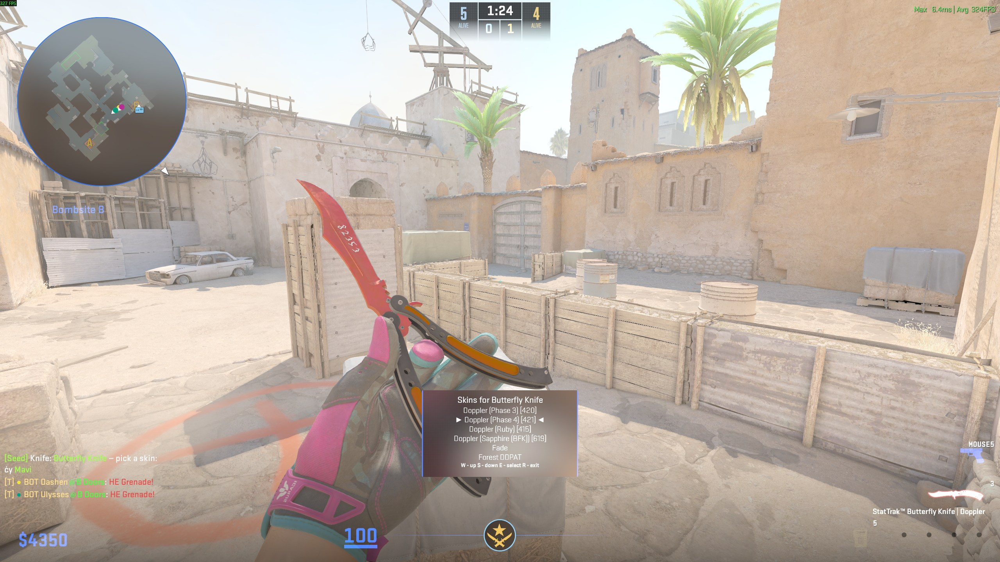
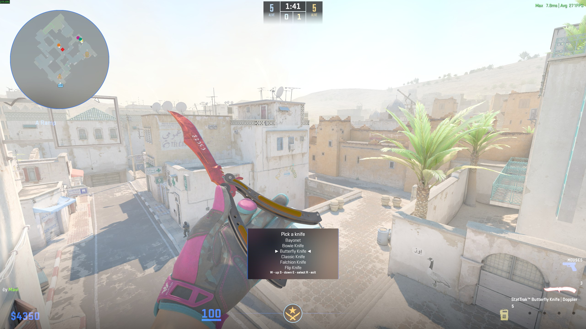

# SeedCommand

A CounterStrikeSharp companion plugin for [Nereziel/cs2-WeaponPaints](https://github.com/Nereziel/cs2-WeaponPaints) that adds **instant in-game skin / knife / glove / sticker pickers** with **automatic application of community-known tier-1 seed patterns** and Factory New wear.

> Code 100% generated by [Claude Code](https://claude.ai/code).
> Commissioned by **Mavi** — [Steam profile](https://steamcommunity.com/profiles/76561198147748231/).
> Attribution to that Steam profile is required when redistributing this plugin.
> No monetary compensation requested — only acknowledgment.



*Butterfly Knife Doppler menu — paint IDs in brackets `[415]` `[421]` `[619]` let you pick the exact phase (Ruby / Phase 4 / Sapphire / Black Pearl / Phase 2) which is otherwise indistinguishable since WeaponPaints' data calls every variant just "Doppler".*

<details>
<summary>More screenshots</summary>

**`!k` — knife type picker (the first menu after typing `!k`):**


**`!ws` — full skin menu for the held weapon (AK-47 here):**


**Result — iBUYPOWER (Holo) Katowice 2014 stickers applied to AK-47 Wild Lotus:**


**Glock-18 Fade with iBUYPOWER (Holo) Katowice 2014:**


</details>

---

## What it adds

| Command | Effect |
|---|---|
| `!k` / `!knife` | Knife type menu → on pick, instantly opens skin menu for that knife → pick → applied with best seed + FN wear + **instant visual refresh** |
| `!ws` | Skin menu for the weapon you're currently holding → pick → applied with best seed + FN wear + instant refresh |
| `!gloves` | Flat list of every glove skin → pick → applied (visual on next round) |
| `!sticker` / `!stickers` | Curated menu of 13 high-value tournament stickers (iBUYPOWER Holo Katowice 2014, Titan Holo, Howling Dawn, Crown Foil, etc.) → pick → pick slot 1-5 (or "ALL 5 slots") → applied + refresh |
| `!seed <n>` | Manually set the paint seed on the held weapon |
| `!bestseed` | Apply the best community-known seed for the held weapon's current paint |
| `!wear <0-1>` / `!float <0-1>` | Set the wear/float of the held weapon (e.g. `!wear 0.001`, `!wear 0.5`) |
| `!fn` | Shorthand for `!wear 0.000001` (Factory New minimum) |

All commands work in chat with the `!` prefix or in console with the `css_` prefix (e.g. `css_seed 661`).

## How it works

Three mechanisms working together:

1. **Menu interception** — The plugin intercepts `!k`, `!ws`, `!gloves`, `!sticker` chat commands BEFORE WeaponPaints sees them and opens its own menus using the same MenuManager interface (`menu:nfcore` capability) WP uses for `!gloves`. This is what gives the "instant chain" feel — there's no waiting for WP's menu to close.

2. **MariaDB triggers** (installed by `setup.sql`) fire on every `wp_player_skins` row change. When the `weapon_paint_id` column changes, the trigger:
   - Looks up the `(defindex, paint_id)` pair in a `best_seeds` table that ships with 299+ community-verified tier-1 patterns
   - If a best seed is known, sets `weapon_seed` to it
   - Resets `weapon_wear` to `0.000001` (Factory New)

3. **Reflection-based WP refresh (v4.3+)** — Instead of trying to inject `!wp` via the chat-trigger path (which doesn't reliably fire when sent by another plugin), this plugin loads the WeaponPaints assembly via reflection and calls its `WeaponSync.GetPlayerData()` + `RefreshWeapons()` methods directly on the WP instance. **This is what makes skin changes instant — no need to type `!wp` manually, no respawn needed.**

## Requirements

- [Metamod:Source](https://www.sourcemm.net/)
- [CounterStrikeSharp](https://github.com/roflmuffin/CounterStrikeSharp) (the plugin was built against 1.0.305, runtime tested up to 1.0.367)
- [WeaponPaints](https://github.com/Nereziel/cs2-WeaponPaints) (this plugin reads its DB and JSON data; the DB triggers operate on `wp_player_skins`)
- [MenuManager](https://github.com/schwarper/cs2-MenuManager) (registered as capability `menu:nfcore` — same one WP uses)
- A MariaDB / MySQL server (already used by WeaponPaints)
- `sv_cheats 1` if you want the "instant visual refresh" feature (the `give` command requires it)

## Install

1. Copy `SeedCommand.dll` and its dependencies into `addons/counterstrikesharp/plugins/SeedCommand/`
2. Run `setup.sql` against the same database WeaponPaints uses:
   ```sh
   mariadb -u <user> -p <database> < setup.sql
   ```
   This creates the `best_seeds` table, populates it, and installs the triggers.
3. Edit `addons/counterstrikesharp/configs/plugins/SeedCommand/SeedCommand.json` with your DB connection details (defaults to `127.0.0.1:3306` with the standard WeaponPaints credentials).
4. Restart the server or `css_plugins reload SeedCommand`.

## Configuration

`SeedCommand.json` is auto-generated on first load:

```json
{
  "DatabaseHost": "127.0.0.1",
  "DatabasePort": 3306,
  "DatabaseUser": "weaponpaints",
  "DatabasePassword": "cs2_local_pw",
  "DatabaseName": "weaponpaints",
  "SkinsJsonPath": "",
  "GlovesJsonPath": "",
  "ForceWeaponRefresh": true
}
```

- Leave `SkinsJsonPath` / `GlovesJsonPath` empty to auto-detect (looks for them under WeaponPaints' install).
- Set `ForceWeaponRefresh` to `false` if your server runs without `sv_cheats 1`.

## Pattern coverage

The shipped `best_seeds` table covers **299 tier-1 patterns** across these skin families:

- **Case Hardened** — all 20 knives + AK-47, Five-SeveN, MAC-10. Sourced from Steam community guides by [korenevskiy](https://steamcommunity.com/id/korenevskiy/myworkshopfiles/?section=guides).
- **Slaughter** — all 19 knife defindexes.
- **Fade** — Karambit #412, AWP #91, Glock #763, plus 100% Fade for every knife defindex.
- **Doppler** — Ruby / Sapphire / Black Pearl + Phases 1-4 for the major knives (Karambit #251, M9 #609, Bayonet #273, Butterfly #602, Talon #613, Stiletto #704, Nomad #136, Skeleton).
- **Gamma Doppler** — Emerald + Phases 1-4 for major knives + Glock-18.
- **Marble Fade Fire & Ice** — best-known seeds for every knife.
- **Crimson Web** — tier-1 web-centric seeds.
- **Damascus Steel, Heat Treated, Tiger Tooth** — best patterns where they exist.
- **Gloves** — Sport Pandora's Box (#264 max purple), Specialist Crimson Kimono (#560), Driver Snow Leopard, Wave Chaser, and many more.

Butterfly Knife uses non-standard paint IDs (617 Black Pearl, 618 Phase 2, 619 Sapphire) verified in-game; Talon Knife Doppler phase paints (852-855) remain best-effort. Pull requests welcome.

## High-value stickers (`!sticker`)

The `!sticker` menu ships with a curated short-list of stickers most players actually care about — instead of dumping the entire ~7000-entry sticker DB:

- iBUYPOWER (Holo) | Katowice 2014
- Titan (Holo) | Katowice 2014
- 3DMAX (Holo) | Katowice 2014
- compLexity Gaming (Holo) | Katowice 2014
- Team Dignitas (Holo) | Katowice 2014
- HellRaisers (Holo) | Katowice 2014
- LGB eSports (Holo) | Katowice 2014
- mousesports (Holo) | Katowice 2014
- Reason Gaming (Holo) | Katowice 2014
- Vox Eminor (Holo) | Katowice 2014
- Crown (Foil)
- King on the Field
- Howling Dawn

Add more to the `HighValueStickers` list in `SeedCommand.cs` if you want them in the menu — IDs can be found in `WeaponPaints/data/stickers_en.json`.

## Credits

Built on top of:

- [WeaponPaints](https://github.com/Nereziel/cs2-WeaponPaints) by Nereziel — the actual skin/sticker/charm system. All credit for the underlying mechanism goes to that project.
- [CounterStrikeSharp](https://github.com/roflmuffin/CounterStrikeSharp) — the C# scripting framework for CS2.
- [MenuManager](https://github.com/schwarper/cs2-MenuManager) by Schwarper — the menu system used for the in-game pickers.
- Pattern guides by [korenevskiy](https://steamcommunity.com/id/korenevskiy/myworkshopfiles/?section=guides) on Steam Community.

## License

MIT — see [LICENSE](LICENSE).

Free to fork, modify, and redistribute as long as the credit header in `SeedCommand.cs` is preserved and the original commission credit (Mavi's Steam profile link) is kept in any forks.
